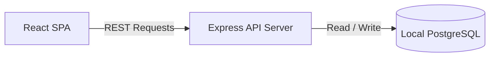
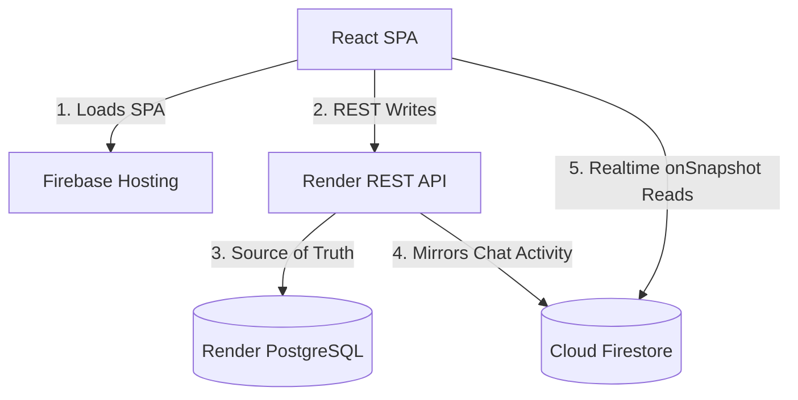

# Ace Digital OS

An internal company operating system and management suite for **Ace Digital** — an IT services company. This monorepo controls projects, teams, employee profiles, payroll/finance, client accounts, approval requests, reports generation, and real-time team communications.

---

## 🏗️ Architecture Overview

Ace Digital OS utilizes a hybrid database approach for local development simplicity and real-time production performance:

### Dev Topology


### Production Topology


1. **REST Operations**: All authenticated actions (authentication, adding users, updating projects, approving requests) are processed via the REST API server hosted on Render.
2. **Data Consistency**: PostgreSQL remains the source of truth for all writes.
3. **Real-time Chat**: For live messaging, the API mirrors message and channel events to Cloud Firestore. The client connects directly to Firestore via standard web SDK `onSnapshot` listeners to receive instantaneous chat updates without API polling. All Firestore client writes are denied by Firestore Security Rules.

---

## 🛠️ Stack & Technologies

- **Monorepo Manager**: [pnpm workspaces](file:///Users/kavin/Documents/GitHub/Ace%20Digital/pnpm-workspace.yaml) (Node.js 24, TypeScript 5.9)
- **Frontend App**: React 19, Vite 7, Tailwind CSS v4, Lucide React, shadcn/ui components
- **REST API Server**: Express 5 (listening on port 8080, prefixed `/api`)
- **Database & ORM**: PostgreSQL, Drizzle ORM, Zod schema validation
- **API Spec & Codegen**: OpenAPI v3 (source spec in [openapi.yaml](file:///Users/kavin/Documents/GitHub/Ace%20Digital/lib/api-spec/openapi.yaml)) + Orval for automated client query hook and validator generation
- **Authentication**: JSON Web Tokens (JWT) Bearer auth, bcryptjs hashing
- **Deployment Surfaces**: Firebase Hosting (static SPA client), Google Cloud Firestore (real-time chat sync), Render (REST API + PostgreSQL database hosting)

---

## 📁 Monorepo Workspaces

The codebase is organized into modular packages under the `artifacts/`, `lib/`, and `scripts/` directories:

### Core Applications (`artifacts/`)
- 💻 **[ace-digital-os](file:///Users/kavin/Documents/GitHub/Ace%20Digital/artifacts/ace-digital-os)**: The React single-page application. Features a modern dashboard, Kanban boards, invoice trackers, approval queues, interactive reports, and Slack-like chat interface.
- ⚙️ **[api-server](file:///Users/kavin/Documents/GitHub/Ace%20Digital/artifacts/api-server)**: Express server serving REST endpoints, executing business logic, enforcing permissions, and syncing chat data to Firestore.
- 🧪 **[mockup-sandbox](file:///Users/kavin/Documents/GitHub/Ace%20Digital/artifacts/mockup-sandbox)**: Independent UI prototyping environment.

### Shared Libraries (`lib/`)
- 📚 **[db](file:///Users/kavin/Documents/GitHub/Ace%20Digital/lib/db)**: Drizzle ORM schemas, migration setup, and connection pools for PostgreSQL. Contains 12 table definitions (users, projects, channels, etc.).
- 🛡️ **[rbac](file:///Users/kavin/Documents/GitHub/Ace%20Digital/lib/rbac)**: Role-Based Access Control logic, permission definitions, context utility functions, and system test suites.
- 🗺️ **[api-spec](file:///Users/kavin/Documents/GitHub/Ace%20Digital/lib/api-spec)**: OpenAPI contract configuration and codegen build setup.
- 🪝 **[api-client-react](file:///Users/kavin/Documents/GitHub/Ace%20Digital/lib/api-client-react)**: Automatically generated TanStack React Query hooks matching REST endpoints.
- 🔒 **[api-zod](file:///Users/kavin/Documents/GitHub/Ace%20Digital/lib/api-zod)**: Generated Zod schema validation guards.

### Operational Utilities (`scripts/`)
- 🔧 **[scripts](file:///Users/kavin/Documents/GitHub/Ace%20Digital/scripts)**: Scripts for database seeding, production environment resets, custom admin seeding, and icon generation assets.

---

## 🚀 Local Development Setup

Follow these steps to run the complete environment locally:

### 1. Prerequisites & Installation
Ensure you have Node.js 24 and `pnpm` installed. Install workspace dependencies:
```bash
pnpm install
```

### 2. Configure Environment Variables
Copy `.env.example` to `.env` in the root:
```bash
cp .env.example .env
```
Fill out the variables. For local Postgres development, verify the `DATABASE_URL` is set correctly.

### 3. Initialize & Seed Database
Use the script bundle to spin up your local Postgres instance, push Drizzle schemas, and load baseline seed data:
```bash
pnpm run db:setup     # Generates database URLs and local Postgres instance parameters
pnpm run db:push      # Pushes Drizzle schemas directly to local Postgres
pnpm run seed         # Seeds local database with dummy users, projects, and finance records
```

### 4. Running the Development Servers
In separate terminals, run the API back-end and React front-end development servers:

- **API Back-end** (Runs on `http://localhost:8080`):
  ```bash
  pnpm --filter @workspace/api-server run dev
  ```
- **React Front-end** (Runs on `http://localhost:21973`):
  ```bash
  pnpm --filter @workspace/ace-digital-os run dev
  ```

---

## ⚡ Development & Maintenance Commands

Below are standard monorepo management scripts declared in [package.json](file:///Users/kavin/Documents/GitHub/Ace%20Digital/package.json):

| Command | Action |
|---------|--------|
| `pnpm run build` | Builds all packages and runs TypeScript compiler checks |
| `pnpm run typecheck` | Executes type-safety checks across the entire monorepo workspaces |
| `pnpm --filter @workspace/api-spec run codegen` | Automatically updates React Query hooks and Zod schemas from OpenAPI specs |
| `pnpm run icons:generate` | Automatically resizes brand elements into production icon bundles |
| `pnpm run seed:firestore` | Syncs local setup baseline mock data into Firestore collections |
| `pnpm run clear:prod` | Wipes dev mocks out of PostgreSQL/Firestore databases |

---

## 👥 Role-Based Access Control (RBAC)

Ace Digital OS enforces structured permissions across 7 different organizational roles defined in the [rbac module](file:///Users/kavin/Documents/GitHub/Ace%20Digital/lib/rbac):

| Role | Operations & Capabilities |
|------|---------------------------|
| `super_admin` | Unrestricted workspace control. The only role authorized to assign other `super_admin` permissions. |
| `management` | Full organizational oversight. Controls projects, teams, generates analytics reports, and acts on approvals. |
| `finance` | Controls salaries, expense sheets, and processes payroll. Approves `EXPENSE` and `PROJECT_BUDGET` requests. |
| `hr` | Manages employee profiles and employee directory records (hides financial fields). Approves `LEAVE` and `HIRING`. |
| `client_manager` | Performs client database CRUD. Read-only access to linked client projects. |
| `team_lead` | Manages team-scoped projects, task assignees, and approves team-member `LEAVE` requests. |
| `employee` | Accesses own dashboard, tasks board, personal profile, and payslips. No access to the global employee directory. |

### Single-Step Approval Matrix

Requests submitted by employees routes to authorized roles depending on approval types:
* **`LEAVE`** ➔ Approved by `team_lead` (same team), `hr`, `management`, or `super_admin`
* **`EXPENSE`** ➔ Approved by `finance`, `management`, or `super_admin`
* **`PROJECT_BUDGET`** ➔ Approved by `management` or `super_admin`
* **`HIRING`** ➔ Approved by `hr`, `management`, or `super_admin`
* **`OTHER`** ➔ Approved by `management` or `super_admin`

---

## 🌐 Production Deployment

For full technical specifications on deployment paths, read the supplementary guides:

1. **[docs/PRODUCTION.md](file:///Users/kavin/Documents/GitHub/Ace%20Digital/docs/PRODUCTION.md)**: Production architecture overview, layout diagram, and hosting target details.
2. **[docs/DEPLOY_RENDER.md](file:///Users/kavin/Documents/GitHub/Ace%20Digital/docs/DEPLOY_RENDER.md)**: Environment variable settings and step-by-step setup guides for deploying the REST API server on Render.
3. **[docs/RENDER_KEEPALIVE_CRON.md](file:///Users/kavin/Documents/GitHub/Ace%20Digital/docs/RENDER_KEEPALIVE_CRON.md)**: Configuring keep-alive hooks from external monitors (cron-job.org / UptimeRobot) to keep the Render free tier API warm.
4. **[FIREBASE.md](file:///Users/kavin/Documents/GitHub/Ace%20Digital/FIREBASE.md)**: Firebase project settings, security rule deployment, Cloud functions configurations, and production admin credentials reset.

---

## 💡 Developer Gotchas & Tips

- **Bcrypt Native Bindings**: Standard `bcrypt` native modules fail to build in local script execution environments. Always import and use `bcryptjs` (pure JavaScript version) in custom utility scripts.
- **Orval Param Collision**: OpenAPI operations containing both query parameters and path parameters can trigger TypeScript namespace collisions during Orval hook generation. Keep path parameters and query parameters distinct, or sanitize the OpenAPI spec.
- **Channels Page Layout**: The Slack-like communication channel is built as a full-screen layout. It deliberately bypasses the central React `AppLayout` wrapper component to maintain viewport-height chat frames.
