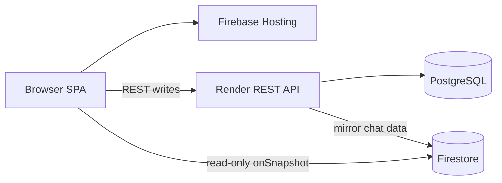

# Ace Digital OS production architecture

## Live services

| Surface | URL |
|---------|-----|
| Web app | https://ace-digital-os.web.app |
| REST API | https://ace-digital-api.onrender.com |
| Health check | https://ace-digital-api.onrender.com/api/healthz |

## Architecture



- Render handles authenticated REST requests.
- PostgreSQL remains the source of truth for API writes.
- Firestore mirrors messages and channel activity for realtime client reads.
- Client Firestore writes are denied by rules.

## Deploy

```bash
pnpm run build:web:render
firebase deploy --only hosting,firestore:rules,firestore:indexes
```

Render auto-deploys the API from the connected repository using `render.yaml`.

## Verify

1. Check `https://ace-digital-api.onrender.com/api/healthz`.
2. Log in at `https://ace-digital-os.web.app`.
3. Send a channel message.
4. Confirm a second authenticated browser receives the update without refreshing.

See [DEPLOY_RENDER.md](DEPLOY_RENDER.md), [CHAT.md](CHAT.md), and [RENDER_KEEPALIVE_CRON.md](RENDER_KEEPALIVE_CRON.md).
