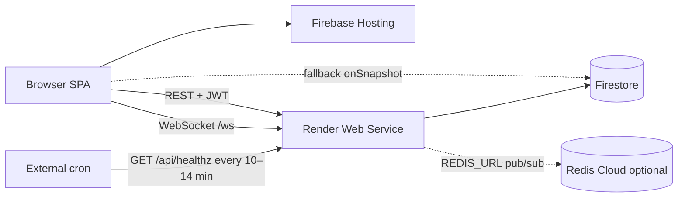

# Ace Digital OS — production architecture

Live stack as of June 2026. Use this doc as the single source of truth for deploy and operations.

## Live URLs

| Surface | URL |
|---------|-----|
| Web app (Firebase Hosting) | https://ace-digital-os.web.app |
| API + WebSocket (Render) | https://ace-digital-api.onrender.com |
| WebSocket path | `wss://ace-digital-api.onrender.com/ws` |
| Health check | https://ace-digital-api.onrender.com/api/healthz |
| Firebase console | https://console.firebase.google.com/project/ace-digital-os |
| Render dashboard | https://dashboard.render.com (service: `ace-digital-api`) |

## Architecture



- **Hosting** serves the static Vite build only. Production builds bake Render URLs via `pnpm run build:web:render`.
- **Render** runs one process: Express REST (`/api/*`) + WebSocket hub (`/ws`). Same codebase as `artifacts/api-server`.
- **Firestore** is the production database (`USE_FIRESTORE=true`). Clients do not write to Firestore directly; the API uses Admin SDK.
- **Redis** (`REDIS_URL`) is optional on a single Render instance; chat uses the in-process hub. Redis is for future multi-instance pub/sub.
- **Firebase Cloud Functions** may still host a bundled API for `/api/**` rewrites; with `VITE_API_BASE_URL` set, the browser calls Render directly and the rewrite is unused.

## Deploy checklist

### 1. Render (API + WebSocket)

Auto-deploys from `main` when Render is connected to GitHub.

| Setting | Value |
|---------|--------|
| Build command | `bash scripts/render-build.sh` |
| Start command | `node --enable-source-maps artifacts/api-server/dist/index.mjs` |
| Health check path | `/api/healthz` |
| Env | `SKIP_INSTALL_DEPS=true` |

Required environment variables: see [env.render.example](env.render.example) and [DEPLOY_RENDER.md](DEPLOY_RENDER.md).

After code changes on `main`, Render redeploys automatically. Verify:

```bash
curl https://ace-digital-api.onrender.com/api/healthz
# {"status":"ok"}
```

### 2. Firebase Hosting (frontend)

From repo root:

```bash
pnpm run build:web:render
firebase deploy --only hosting
```

`build:web:render` sets:

- `VITE_API_BASE_URL=https://ace-digital-api.onrender.com`
- `VITE_REALTIME_WS_URL=wss://ace-digital-api.onrender.com/ws`
- `BASE_PATH=/`

Output: `artifacts/ace-digital-os/dist/public` (see `firebase.json` → `hosting.public`).

### 3. Keep Render awake (free tier)

Render free web services spin down after ~15 minutes idle. Use an **external** cron (not Render Cron Jobs):

- URL: `https://ace-digital-api.onrender.com/api/healthz`
- Interval: every **10–14 minutes**

Details: [RENDER_KEEPALIVE_CRON.md](RENDER_KEEPALIVE_CRON.md).

### 4. Secrets hygiene

- Never commit `JWT_SECRET`, service account JSON, or Redis passwords.
- `JWT_SECRET` on Render must match the secret used to sign tokens in production (same as Firebase Functions auth if you still use that path for login).
- Rotate credentials if they were pasted in chat, logs, or screenshots.

## Frontend environment (build-time)

See [env.production.example](env.production.example). The `build:web:render` script in root `package.json` applies the production Render URLs; you only need a local `.env.production` if you build without that script.

## Chat realtime

Channel messages: REST write on Render → in-process (and optional Redis) publish → WebSocket `message:*` events to subscribed clients. If WebSocket is down, `VITE_FIREBASE_CHAT=true` enables Firestore `onSnapshot` fallback.

Full protocol and dev setup: [CHAT.md](CHAT.md).

## Optional / legacy paths

| Path | Status |
|------|--------|
| `artifacts/realtime-server` + Cloud Run | Not used in current production; API embeds `/ws` |
| `pnpm run deploy:realtime` | Only if you split WS to Cloud Run again |
| Firebase `/api/**` → Functions rewrite | Unused when `VITE_API_BASE_URL` points to Render |
| Postgres `DATABASE_URL` | Local / dev; production uses Firestore |

## Cost (small team, light use)

| Service | Typical cost |
|---------|----------------|
| Firebase Hosting + Firestore | $0–3/mo (free tier / light Blaze) |
| Render Free (API+WS) | $0 (with spin-down + external cron) |
| Redis Cloud free | $0 within limits |
| **Total** | **~$0–3/mo** |

Upgrade Render to Starter (~$7/mo) to avoid spin-down.

## Related docs

- [DEPLOY_RENDER.md](DEPLOY_RENDER.md) — Render setup, build failures, Redis TLS URL
- [RENDER_KEEPALIVE_CRON.md](RENDER_KEEPALIVE_CRON.md) — cron-job.org / UptimeRobot
- [CHAT.md](CHAT.md) — WebSocket protocol, fallback, local dev
- [FIREBASE.md](../FIREBASE.md) — Firebase project, Hosting, Firestore, Functions (legacy API path)
- [env.render.example](env.render.example) — Render env template
- [env.production.example](env.production.example) — Vite production build template

## Verify after deploy

1. Open https://ace-digital-os.web.app — login works.
2. DevTools → Network: API requests go to `ace-digital-api.onrender.com`, not only `/api` on Hosting.
3. Channels: send a message; second browser/tab updates without refresh.
4. DevTools → WS: connection to `wss://ace-digital-api.onrender.com/ws` with JWT auth frame after open.
