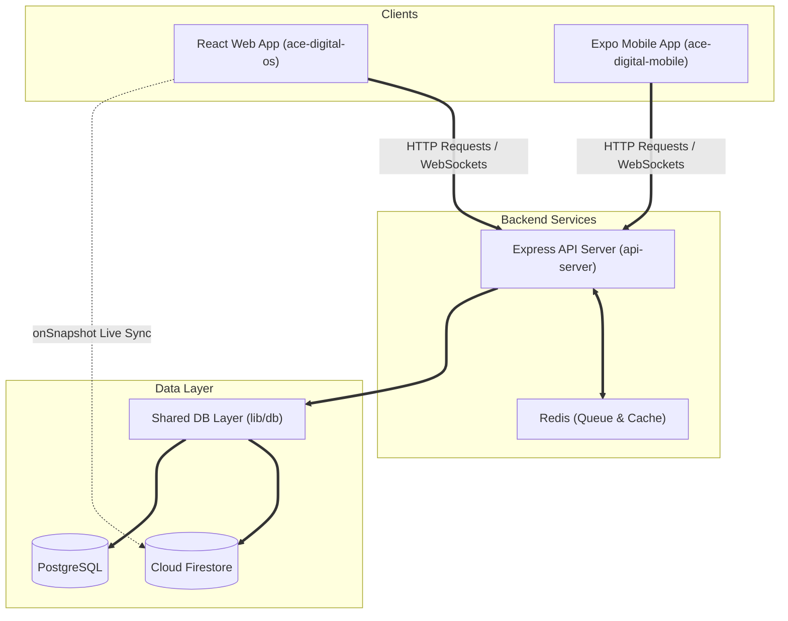

# Ace Digital Workspace Architecture

This document describes the high-level architecture of the Ace Digital workspace, details its components, and explains how data is synchronized across the web application, mobile application, and backend API server.

---

## 1. Monorepo Overview

The workspace uses a `pnpm` monorepo configuration to share typescript code, types, database drivers, and security modules across all services. The main directories are:

- **`artifacts/api-server`**: Express API server running on Node.js. Serves as the primary ingress point for both clients. Supports REST endpoints and Socket.io WebSocket servers.
- **`artifacts/ace-digital-os`**: React Vite SPA (Single Page Application) that serves as the desktop/web client.
- **`artifacts/ace-digital-mobile`**: Expo (React Native) app serving as the mobile client.
- **`lib/db`**: Shared database wrapper that encapsulates PostgreSQL queries (via Drizzle ORM) and Cloud Firestore (via firebase-admin).
- **`lib/rbac`**: Shared module containing role-based access controls and permissions.
- **`lib/api-client-react`**: Shared queries and mutation hooks generated automatically from the API specs.

---

## 2. Real-time Synchronization & Chat Sinking

The real-time chat data flow is designed to ensure sub-second sync between web and mobile clients:

1. **Message Sent (Mobile)**:
   - Mobile client sends the message via WebSocket event (`message:send`) or HTTP fallback (`POST /v1/channels/:id/messages`).
   - The API server receives the payload.
   
2. **API Server Processing & Persistence**:
   - If a Redis server is active, the job is queued to BullMQ for asynchronous database insertion.
   - If Redis is disconnected, the server executes a **direct database persist** fallback.
   - The database layer (`lib/db`) writes to PostgreSQL (dev) or Firestore (prod). In Postgres mode, it mirrors the message asynchronously to Firestore (`channels/{channelId}/messages`).

3. **Message Sync (Web)**:
   - The web app is directly subscribed to the Firestore `channels/{channelId}/messages` subcollection using `onSnapshot`.
   - As soon as the message is committed to Firestore (either directly or via mirror), the Firestore listener fires, and the message appears on the web app in milliseconds.

4. **Message Sync (Mobile)**:
   - When the API server completes database persistence, it broadcasts a WebSocket event (`message:persisted`) containing the final message object.
   - Subscribed mobile clients receive the socket payload and instantly replace their local optimistic/sending state with the persisted message.

---

## 3. High-Availability Fallbacks

To prevent failures from blocking communications, several fail-safes are built into the synchronization layer:

- **Redis Connection Fallback**: If Redis crashes or is offline, the API server bypasses the queue and writes messages directly to the database store.
- **WebSocket Polling Fallback**: If socket connections fail, the mobile app switches to HTTP polling, ensuring messages are retrieved and delivered via REST endpoints.
- **Firestore Dual Writing**: In Postgres mode, failures in Firestore sync do not block local PostgreSQL writes, ensuring high availability.
